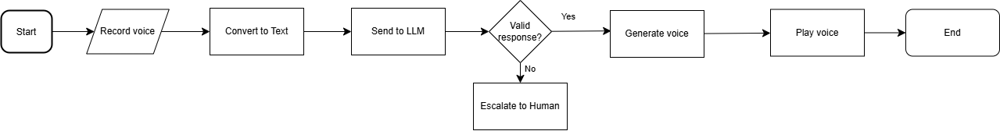

# SERA (Sentuh, Empati, Reaksi, Aksi) Assistant

## Introduction

SERA is a voice-based assistant designed to support individuals who may have experienced sexual harassment. The application allows users to speak in Indonesian about their experiences and concerns, receiving empathetic and supportive responses. It serves as a first step in the support process, offering a safe space for users to express themselves and receive guidance.

## Purpose and Intent

The development of this assistant is motivated by several key factors:

- **Accessibility:** Many individuals may find it difficult to type or articulate their experiences in written form, especially during emotional distress.
- **Initial Support:** While not a replacement for professional help, SERA provides immediate emotional validation and support.
- **Resource Connection:** The application helps direct users to professional resources when appropriate.

## System Flow

SERA follows a structured pipeline to provide support:

1. **Audio Recording:** The system records the user's voice input.
2. **Speech-to-Text:** Deepgram's API converts the spoken Indonesian into text.
3. **AI Response Generation:** OpenRouter (GPT-4o) processes the input and generates an appropriate, empathetic response.
4. **Text-to-Speech:** Google Cloud TTS converts the AI-generated response into natural-sounding Indonesian speech.
5. **Audio Playback:** The system plays the response back to the user.




SERA is designed to be a compassionate and accessible tool, ensuring that those in distress have a supportive and non-judgmental space to express themselves.

## Important Notes
- **Not a Diagnostic Tool**: This application is not designed to diagnose any mental health conditions or provide medical advice.
- **Not a Replacement**: While helpful for initial support, this tool should not replace professional counseling

## Setup and Configuration

### Prerequisites
- Python 3.8 or newer
- Required API keys:
  1. **OpenRouter API key**
  2. **Deepgram API key**
  3. **Google Cloud API key** with Text-to-Speech enabled

### Installation
#### Clone the repository:
```bash
git clone https://github.com/yourusername/SERA-Assistant.git
cd SERA-Assistant
```

#### Install dependencies:
```bash
pip install requests sounddevice soundfile deepgram-sdk python-dotenv
```

#### Create a `.env` file with your API keys:
```ini
OPENROUTER_API_KEY=your_openrouter_api_key
DEEPGRAM_API_KEY=your_deepgram_api_key
GCP_API_KEY=your_google_cloud_api_key
PROMPT="Prompt kamu untuk mendukung orang-orang dalam hal kekerasan seksual"
```

## Usage
1. Ensure your microphone is properly configured and working.
2. Run the application:
   ```bash
   python sera_main.py
   ```
3. When prompted, **speak in Indonesian** about your experience or concern.
4. Listen to the **empathetic response** provided by SERA.

This ensures a seamless setup and experience for users seeking support through the SERA assistant.